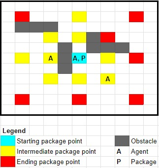
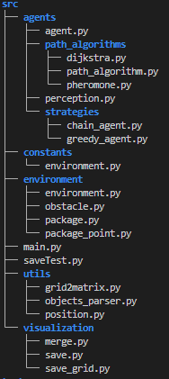

# Multi-Agent Techniques Project - WiSe23/24

## Group G Deliverable 1 - Reactive agents

This repository contains the source code for the Multi-Agent Techniques 1st deliverable project undertaken by Group G for the WiSe23/24 subject.

## Table of Contents
1. [Overview](#overview)
2. [Installation](#installation)
3. [Usage](#usage)
4. [Structure](#structure)
4. [License](#license)
5. [Acknowledgements](#acknowledgements)

## Overview

Pickup & delivery tasks in the real world usually involve multiple entities (agents) interacting in a common space (environment). 

In the present work, we develop a multi-agent system for package distribution in a grid, where intermediate package points enhance delegation and obstacles randomly appear & disappear.



## Installation

1. Clone the repository
2. Install the dependencies in requirements.txt with pip
```bash
# Example installation steps with pip
git clone https://github.com/asicoderOfficial/MAS-WiSe23_24-TUB_MSc
cd MAS-WiSe23_24-TUB_MSc
pip install -r requirements.txt
```

## Usage
Run the main.py file like
```python
python -m src.main
```
You can also equivalently try to run src/experiment1.py and src/experiment2.py


## Structure
See the structure of the source code:



Check the logs and plots of the experiments at experiments/ directory.

See the 3 grids of the experiments in imgs/grids/ directory.

## License

MIT License.

## Acknowledgements
- Asier Serrano Aramburu
- Maxim Popov
- Omadbek Meliev 
